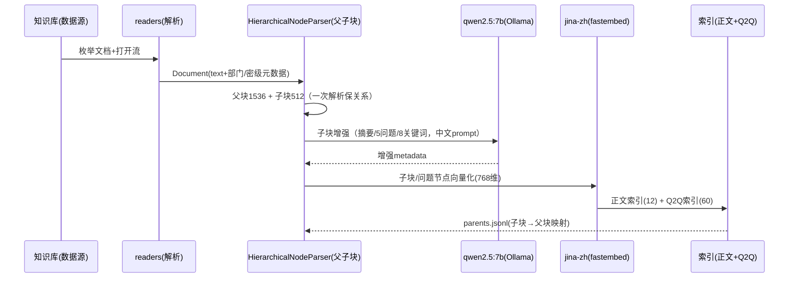
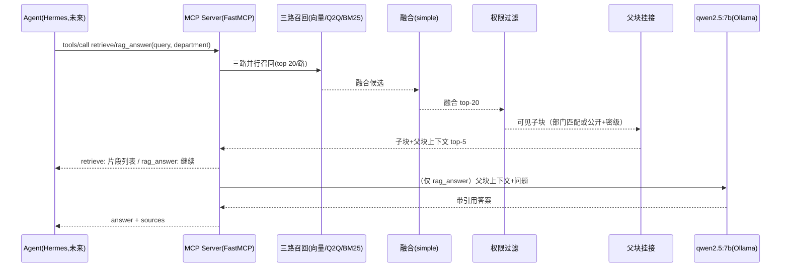

# 公司内部 RAG 系统 — 整体架构说明（当前实现版）

> 本文基于 `RAG系统设计方案.md` 落地后的**实际实现**整理，说明离线建索引与在线
> 检索增强生成两个阶段，并标注每一步使用的技术/模型，以及与设计文档的差异与原因。
>
> 代码位置：`rag/`（独立 Python 项目，LlamaIndex + FastMCP，全离线可运行）。
> 配套文档：`README.md`（使用）、`开发决策记录.md`（决策与踩坑）、`config.yaml`（配置）。

---

## 0. 架构总览

```
┌─────────────────────────────────────────────────────────────────────┐
│                         离线阶段（建索引）                            │
│                                                                     │
│  数据源(KnowledgeSource) → 解析 → 父子块 → LLM增强 → Embedding      │
│      local_dir / company_stub   │        │   qwen2.5:7b   jina-zh   │
│                                 ▼        ▼             ▼            │
│                           12 子块+8 父块     摘要/问题/关键词  768 维  │
│                                 │                                    │
│                                 ▼                                    │
│           正文索引(.data/index)  +  Q2Q索引(.data/index_q2q)          │
│           VectorStoreIndex(12)     问题节点(60)                       │
│           + nodes.jsonl/parents.jsonl                                │
└─────────────────────────────────────────────────────────────────────┘

┌─────────────────────────────────────────────────────────────────────┐
│                         在线阶段（检索增强生成）                       │
│                                                                     │
│   Agent(Hermes, 未来) ──MCP tools/call──► retrieve / rag_answer     │
│                                            │                        │
│               ┌───────────────┬────────────┴───────┐                │
│               ▼               ▼                    ▼                │
│           向量路            Q2Q路                BM25路              │
│        VectorIndex      (问题命中→映射          (CJK二元组          │
│        Retriever        回原子块)             bm25s)               │
│               └───────────────┴────────────┬───────┘                │
│                                            ▼                        │
│                              融合 QueryFusionRetriever              │
│                              mode=simple（分数归一求和）              │
│                                            ▼                        │
│                            ACL 权限过滤（部门/密级）                  │
│                                            ▼                        │
│                            父块上下文挂接 parent_text                │
│                                            ▼                        │
│                        top_k 结果（retrieve）/  LLM 生成（rag_answer）│
│                                                    qwen2.5:7b       │
└─────────────────────────────────────────────────────────────────────┘
```

---

## 1. 技术栈总览

| 环节 | 技术/组件 | 模型 | 说明 |
| --- | --- | --- | --- |
| 编排 | llama-index-core 0.14.24 | — | Ingestion / Retriever / Fusion / Extractor |
| 解析 | llama-index-readers-file（pypdf / docx2txt / python-pptx） | — | 按扩展名路由；失败进 DLQ |
| 分块 | HierarchicalNodeParser | — | 父块 1536 / 子块 512，重叠 64 |
| Chunk 增强 | SummaryExtractor / QuestionsAnsweredExtractor / KeywordExtractor | qwen2.5:7b（Ollama） | 中文 prompt，输出摘要/5 预设问题/8 关键词 |
| Embedding | llama-index-embeddings-fastembed + fastembed 0.8（ONNX） | jinaai/jina-embeddings-v2-base-zh（768 维，中英混合） | 全离线，CPU 可跑；bge-m3 为升级路径 |
| 正文索引 | VectorStoreIndex + SimpleVectorStore | — | `.data/index`，12 个子块节点 |
| Q2Q 索引 | VectorStoreIndex（独立目录） | — | `.data/index_q2q`，60 个问题节点 |
| BM25 | bm25s + 自研 `ChineseBM25Retriever` | — | CJK 二元组 + 英文单词分词（官方 BM25 对中文无效） |
| 融合 | QueryFusionRetriever | — | `mode=simple`（分数归一求和）；rrf 实测有缺陷 |
| 权限过滤 | 自研 ACL（metadata 过滤） | — | 部门匹配 或 公开文档；密级白名单 |
| 父子块挂接 | 自研 parents.jsonl 映射 | — | 子块命中、父块作答 |
| 生成 | llama-index-llms-ollama | qwen2.5:7b（Ollama，RTX 3060 6GB，约 9 tok/s） | rag_answer：父块上下文 + 引用 |
| MCP 服务 | fastmcp 3.4.7（mcp 2.x 拆包后的独立包） | — | stdio 传输，retrieve / rag_answer / list_knowledge_bases |
| 评测 | 自研 doc 级 hit_rate / mrr | — | 51 条 Golden Set，分题型统计 + 5 条权限用例 |

---

## 2. 离线阶段：建索引

> 目标：把内部知识文档（PDF/DOC/PPT/MD）解析、切分、增强、向量化，产出可检索的
> 正文索引 + Q2Q 索引 + 父块映射。一次 `build_kb` 全量完成，`build_q2q` 可单独补建。

### 2.1 数据源适配层（datasources/）

- **`KnowledgeSource` 接口**：只负责「枚举文档 + 打开文件流」，与下游完全解耦
  （这是解决"拿不到公司知识库"的关键设计——数据源是唯一随环境替换的部分）。
- `LocalDirectorySource`：扫描目录 + 读取 `manifest.csv`（每文档的
  `department` / `confidentiality` 权限元数据），当前用于自编"云雀科技"样例库。
- `CompanyKnowledgeSource`：公司真实数据源占位（NAS/Confluence/API 形态，未实现）。

### 2.2 文档解析（ingest/readers.py）

按扩展名路由到 llama-index Reader，文本归一为带元数据的 `Document`：

| 格式 | Reader | 底层 |
| --- | --- | --- |
| .md / .txt | 直接读文本 | — |
| .pdf | `PDFReader` | pypdf（文本层抽取；扫描件 OCR 为后续阶段） |
| .docx | `DocxReader` | docx2txt |
| .pptx | `PptxReader` | python-pptx（含备注页文本） |

解析失败/为空 → 记录到 **DLQ 异常队列**（打印告警），不静默丢弃，不中断整批。

### 2.3 父子块分块（HierarchicalNodeParser）

- 参数：`chunk_sizes=[1536, 512]`，`chunk_overlap=64`（config: `chunking.*`）。
- 输出：**父块（1536，用于作答上下文）+ 子块（512，用于检索命中）**；Parser 只调用
  一次保证父子关系一致（当前样例库：8 父块 + 12 子块）。
- 子块带 `NodeRelationship.PARENT` 关系 → 落盘为 `parents.jsonl`（`leaf_id → 父块`
  映射，检索时 O(1) 挂接）。
- 备选：`chunking.hierarchical: false` 可回退为平铺 `SentenceSplitter`。

### 2.4 Chunk 增强（LLM，ingest/pipeline.py enhance_nodes）

三个 Extractor 的 prompt 已本地化为**中文**，输出写入子块 metadata：

| Extractor | 输出（metadata 键） | 用途 |
| --- | --- | --- |
| `SummaryExtractor` | `section_summary`（1-3 句中文摘要） | 语义粗筛/文档摘要索引（未来） |
| `QuestionsAnsweredExtractor` | `questions_this_excerpt_can_answer`（5 个中文预设问题，`embedding_only=False`） | **Q2Q 索引的原料** |
| `KeywordExtractor` | `excerpt_keywords`（8 个中文关键词） | BM25/关键词召回（可并入） |

模型：**qwen2.5:7b**（Ollama，`llm.enabled: true`）。11~12 个子块 × 3 个增强器 ≈
33 次 LLM 调用，约 3 分钟（RTX 3060，9 tok/s）。未启用 LLM 时跳过增强，流水线不阻塞。

### 2.5 向量化（Embedding）

- 模型：**jinaai/jina-embeddings-v2-base-zh**（fastembed/ONNX，**768 维**，中英混合，
  模型缓存 `.data/models`，约 1.2GB，全离线）。
- 选择原因：fastembed 0.8 不支持设计文档指定的 bge-m3；jina-zh 对本语料实测
  命中质量高（hit_rate 100%）。
- 升级路径：`config.embedding.backend: huggingface` + `model: BAAI/bge-m3`
  （需装 torch + sentence-transformers，代码零改动）。

### 2.6 索引构建与持久化（.data/）

| 产物 | 位置 | 内容 |
| --- | --- | --- |
| 正文索引 | `.data/index/` | `VectorStoreIndex`（12 个子块向量，SimpleVectorStore）+ docstore/index_store |
| 节点清单 | `.data/index/nodes.jsonl` | 子块 text + metadata（含增强字段），供 BM25/评测/加载 |
| 父块映射 | `.data/index/parents.jsonl` | `leaf_id → parent_id/parent_text/parent_metadata`（12 条） |
| Q2Q 索引 | `.data/index_q2q/` | `VectorStoreIndex`（60 个问题节点，独立目录，避免多索引加载歧义） |

> 说明：llama-index 0.14 创建索引时无法指定 index_id（自动 UUID），多索引共享
> StorageContext 会导致加载歧义，故 Q2Q 索引独立成目录、单索引加载。

### 2.7 离线流程时序



### 2.8 一键命令

| 命令 | 作用 |
| --- | --- |
| `python -m rag.scripts.generate_sample` | 生成"虚拟公司"样例库 |
| `python -m rag.scripts.build_kb` | 全量建库（解析→父子块→增强→正文+Q2Q 索引） |
| `python -m rag.scripts.build_q2q` | 给已有库补建 Q2Q 索引（不重跑 LLM） |
| `python -m rag.scripts.dl_model` | 预取嵌入模型（离线引导） |

---

## 3. 在线阶段：检索增强生成

> 目标：Agent 经 MCP 调用 `retrieve`（只检索）或 `rag_answer`（检索+生成），
> 拿到带来源、带权限过滤、带父块上下文的片段或答案。

### 3.1 工具接口（FastMCP，server/rag_server.py）

| 工具 | 参数 | 返回 |
| --- | --- | --- |
| `retrieve` | query, top_k=5, department?, confidentiality? | 片段列表：text（子块命中证据）+ parent_text（父块上下文）+ source（doc_id/标题/部门/密级）+ score |
| `rag_answer` | query, department? | answer（LLM 生成，中文，带来源引用）+ sources |
| `list_knowledge_bases` | — | 可检索文档清单（标题/部门/密级） |

传输：stdio（mcp 2.x 的 FastMCP 为独立包 `fastmcp`）；注册进 AionCore `aionui-mcp`
（hermes 适配器）为阶段三工作。

### 3.2 三路召回（retrieve/）

| 路 | 检索器 | 命中对象 | 技术要点 |
| --- | --- | --- | --- |
| 向量路 | `VectorIndexRetriever` | 正文子块（768 维向量相似） | 语义召回主路 |
| Q2Q 路 | `Q2QRetriever`（自研映射器） | 问题节点 → `source_chunk_id` 映射回原子块 | 消除"问法 vs 原文措辞"鸿沟；命中问题即认为子块相关 |
| BM25 路 | `ChineseBM25Retriever`（自研） | 正文子块（关键词） | CJK 字+二元组分词 + bm25s；官方 BM25 空白分词对中文无效 |

每路取 `fusion_top_k=20`。

### 3.3 融合（QueryFusionRetriever）

- 模式：**`simple`**（各路分数归一后求和）——实测最优（51 条 hit_rate 100% / mrr 0.9771）。
- 关键调优结论：设计文档建议的 **RRF 会淹没"单路强命中"**（多路中位干扰文档能压过
  BM25 单路 rank1 的精确命中），已用 `config.retrieval.fusion_mode` 可配置
  （`rrf | simple | relative_score | dist_based`），默认 simple。

### 3.4 权限过滤（ACL，自研）

语义（设计方案 §6.3 Step 4）：**部门匹配 或 公开文档**；调用方声明密级时仅返回
不高于该密级的文档（public < internal < secret）。过滤在融合之后、top_k 之前，
保证越权内容不进最终结果。用户身份（部门/密级）由宿主（AionCore）透传。

### 3.5 父块上下文挂接

- 每个命中子块经 `parents.jsonl` 查找父块 → 结果附 `parent_text`（大而全的作答上下文）。
- 设计文档的 `AutoMergingRetriever` 在 0.14 只接受 `VectorIndexRetriever`（无法包
  三路融合），故采用"检索后挂接"的等价实现。

### 3.6 生成（rag_answer）

1. 走 `retrieve` 完整链路（三路召回 → simple 融合 → ACL 过滤 → 父块挂接 → top_k=5）；
2. 组装 prompt：父块上下文（带来源编号）+ 用户问题，中文指令"严格基于知识片段回答、
   证据不足如实说明、末尾列引用来源"；
3. **qwen2.5:7b**（Ollama）生成 → 返回 answer + sources（来源含标题/部门/密级）。

### 3.7 在线流程时序



---

## 4. 评测体系（当前状态）

| 层 | 内容 |
| --- | --- |
| 题型覆盖 | 51 条 Golden Set：常规 31 / 问法差异 6 / 跨文档 4 / 多跳 4 / 干扰 6 |
| 指标 | doc 级 hit_rate / mrr（业务关心的"命中文档"粒度） |
| 权限 | 5 条越权用例（部门不符/密级不足 → 断言 0 泄漏） |
| 当前基线 | **hit_rate 100% / mrr 0.9771**；干扰类 mrr 0.8056（唯一短板，作为未来 Rerank 的 A/B 基准） |

---

## 5. 与设计文档的差异及原因（关键决策速查）

| 设计文档建议 | 实际实现 | 原因 |
| --- | --- | --- |
| bge-m3（HuggingFaceEmbedding） | jina-embeddings-v2-base-zh（fastembed/ONNX，768 维） | fastembed 0.8 不支持 bge-m3；jina-zh 实测命中质量高；升级路径已留（config 一行 + torch） |
| BM25Retriever（官方） | 自研 ChineseBM25Retriever（CJK 二元组 + bm25s） | 官方按空白分词，对中文无效 |
| QueryFusionRetriever RRF | mode=simple | RRF 实测淹没单路强命中（"常用系统"脱靶），simple 51/51、mrr 更高 |
| AutoMergingRetriever | 检索后父块挂接（parents.jsonl） | 0.14 的 AutoMerging 只接受 VectorIndexRetriever，无法包三路融合 |
| mcp.server.fastmcp（mcp 1.x） | fastmcp 独立包 | mcp 2.x 拆包，API 一致 |
| LlamaParse/OCR | 私有化 Reader（pypdf/docx2txt/pptx），扫描件 OCR 未接 | 全离线约束；OCR 为后续阶段 |
| Rerank（FlagEmbeddingReranker） | 暂缓（配置开关已留） | 当前评测饱和，先扩 51 条 Golden 建基准；候选 LLMRerank（零依赖）/ bge-reranker-v2-m3（torch，需换显存） |

**本机环境适配**（非设计差异，见 `开发决策记录.md`）：0700 目录 ACL 补丁（`_winfix.py`）、
HF Hub 走系统代理（不可设 HF_ENDPOINT 镜像）、uv 项目内缓存、UTF-8 控制台输出。

---

## 6. 目录结构与配置映射

```
rag/
├── config.yaml / .env / run.ps1 / pyproject.toml / README.md / 开发决策记录.md
├── src/rag/
│   ├── _winfix.py            # Windows 0700 目录补丁
│   ├── config.py             # 配置加载
│   ├── datasources/          # 数据源适配层（local_dir / company_stub）
│   ├── ingest/               # 离线：readers → pipeline(父子块/增强/索引) → q2q
│   ├── retrieve/             # 在线：service(融合/ACL/父块) + bm25_zh + q2q
│   ├── server/               # FastMCP: retrieve / rag_answer / list_knowledge_bases
│   ├── eval/                 # golden_set(51条) + evaluate(分类 hit_rate/mrr + ACL)
│   └── scripts/              # generate_sample / build_kb / build_q2q / query / run_eval / mcp_smoke / dl_model
├── sample_data/              # （生成）虚拟公司样例库
└── .data/                    # （生成）索引 + 模型缓存
    ├── index/                # 正文索引 + nodes.jsonl + parents.jsonl
    ├── index_q2q/            # Q2Q（问题）索引
    └── models/               # jina-zh ONNX 模型缓存
```

`config.yaml` 关键项与环节的对应：

| 配置 | 环节 |
| --- | --- |
| `datasource.type/params` | 数据源适配层 |
| `chunking.hierarchical / leaf / parent` | 父子块分块 |
| `llm.enabled / model / base_url` | LLM（增强 + rag_answer），Ollama |
| `embedding.backend / model` | 向量化 |
| `index.persist_dir / q2q_persist_dir` | 索引持久化 |
| `retrieval.fusion_top_k / fusion_mode / top_k` | 召回与融合 |
| `retrieval.rerank.enabled` | Rerank（预留，暂缓） |

---

## 7. 当前状态与待办

- [x] 离线建索引：解析 → 父子块 → LLM 增强 → jina-zh 向量化 → 正文+Q2Q 索引
- [x] 在线检索：三路召回 → simple 融合 → ACL → 父块挂接 → top_k
- [x] 生成：rag_answer（qwen2.5:7b，父块上下文 + 引用）
- [x] 评测基线：51 条 Golden（分题型）+ 权限用例，hit_rate 100% / mrr 0.9771
- [ ] 阶段二剩余：Rerank（LLMRerank 或 bge-reranker-v2-m3，以干扰类 mrr 为 A/B 基准）
- [ ] 阶段三：AionCore `aionui-mcp` 增加 hermes 适配器 → 注册 RAG Server → 前端
  ToolsSettings → 用户身份透传；公司真实知识库按形态实现 `KnowledgeSource` 替换数据源
- [ ] 阶段四：可观测（Phoenix/LlamaTrace）、CI 回归、A/B
